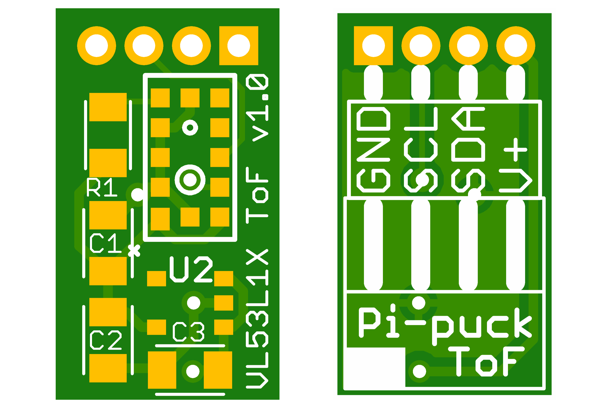

# Time-of-Flight Distance Sensor for the Pi-puck

**A VL53L1X/VL53L0X time-of-flight distance sensor board for use with the Pi-puck robot platform.**

See https://github.com/yorkrobotlab/pi-puck for more information on the Pi-puck.

## PCB Layout

## Licence

Hardware designs are licensed under a [Creative Commons Attribution-ShareAlike 4.0 International Licence][cc-by-sa].

[cc-by-sa]: http://creativecommons.org/licenses/by-sa/4.0/
